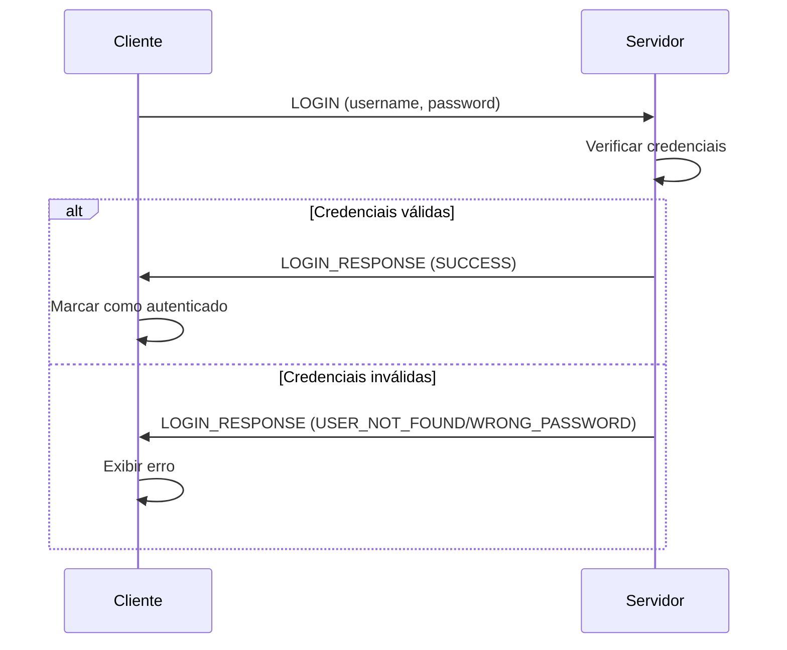
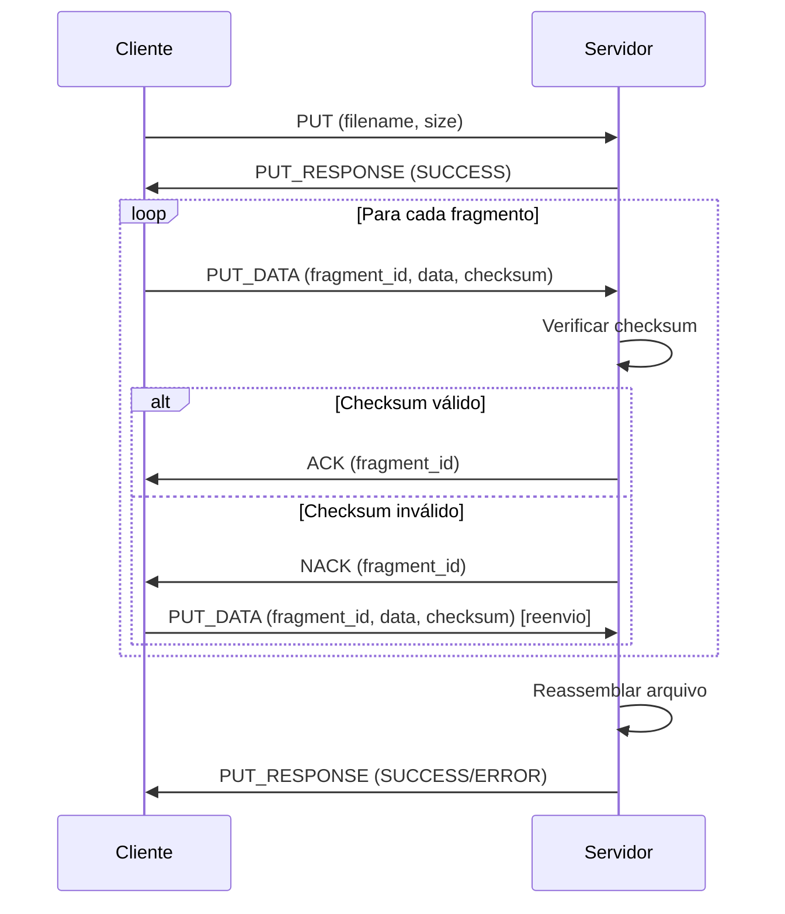
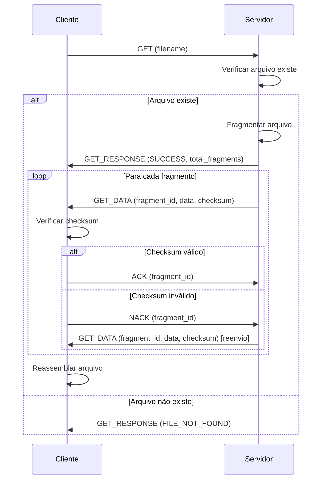
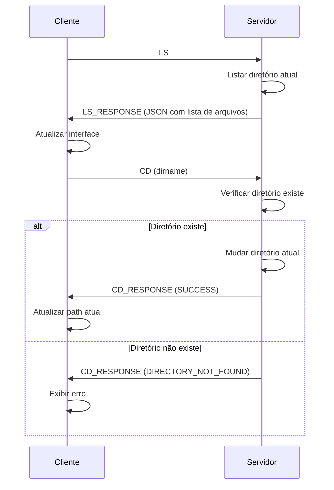

# myFTudP - Documentação Técnica Completa

## Visão Geral do Projeto

O **myFTudP** é uma implementação completa de um sistema cliente-servidor FTP sobre protocolo UDP, desenvolvido como projeto acadêmico para demonstrar conceitos de redes de computadores e engenharia de software. O projeto combina um protocolo de comunicação personalizado com uma interface gráfica moderna construída em Electron.

### Características Principais

- **Protocolo FTP Customizado sobre UDP**: Implementação própria de protocolo confiável sobre UDP
- **Interface Gráfica Moderna**: Cliente desktop construído com Electron e tecnologias web
- **Transferência de Arquivos**: Upload e download com fragmentação automática e controle de integridade
- **Navegação de Diretórios**: Suporte completo a operações de sistema de arquivos
- **Autenticação**: Sistema de usuários com controle de acesso
- **Feedback Visual**: Interface responsiva com indicadores de progresso em tempo real

### Tecnologias Utilizadas

- **Backend**: Node.js com módulos nativos (dgram, fs, path)
- **Frontend**: HTML5, CSS3, JavaScript ES6+
- **Framework Desktop**: Electron
- **Protocolo**: UDP com camada de confiabilidade customizada
- **Design System**: Material Design 3 adaptado
- **Arquitetura**: Cliente-Servidor com comunicação assíncrona

## Arquitetura do Sistema

### Visão Geral da Arquitetura

```
┌─────────────────────────────────────────────────────────────┐
│                    APLICAÇÃO CLIENTE                        │
├─────────────────────────────────────────────────────────────┤
│  ┌─────────────────┐  ┌──────────────────────────────────┐  │
│  │  Electron Main  │  │        Renderer Process          │  │
│  │    Process      │  │                                  │  │
│  │                 │  │  ┌─────────────┐ ┌─────────────┐ │  │
│  │ ┌─────────────┐ │  │  │    HTML     │ │     CSS     │ │  │
│  │ │   main.js   │ │  │  │ (Interface) │ │  (Estilos)  │ │  │
│  │ │             │ │  │  └─────────────┘ └─────────────┘ │  │
│  │ │ IPC Handler │ │  │  ┌─────────────┐ ┌─────────────┐ │  │
│  │ │             │ │  │  │ JavaScript  │ │  Preload    │ │  │
│  │ │ File System │ │  │  │   (app.js)  │ │   Script    │ │  │
│  │ │   Access    │ │  │  └─────────────┘ └─────────────┘ │  │
│  │ └─────────────┘ │  └──────────────────────────────────┘  │
│  └─────────────────┘                                       │
│           │                                                │
│  ┌─────────────────┐                                       │
│  │ myFTudP Client  │                                       │
│  │    (client.js)  │                                       │
│  │                 │                                       │
│  │ • Conexão UDP   │                                       │
│  │ • Fragmentação  │                                       │
│  │ • Reassembly    │                                       │
│  │ • Event System  │                                       │
│  └─────────────────┘                                       │
└─────────────────────────────────────────────────────────────┘
                           │
                     ┌─────┴─────┐
                     │    UDP    │
                     │  Network  │
                     └─────┬─────┘
                           │
┌─────────────────────────────────────────────────────────────┐
│                   SERVIDOR myFTudP                          │
├─────────────────────────────────────────────────────────────┤
│  ┌─────────────────────────────────────────────────────────┐ │
│  │              server.js (Node.js)                       │ │
│  │                                                         │ │
│  │ ┌─────────────┐ ┌─────────────┐ ┌─────────────────────┐ │ │
│  │ │   Socket    │ │   Client    │ │    File System      │ │ │
│  │ │   Manager   │ │   Manager   │ │      Manager        │ │ │
│  │ │             │ │             │ │                     │ │ │
│  │ │ • Bind Port │ │ • Auth      │ │ • Listagem         │ │ │
│  │ │ • Receive   │ │ • Sessions  │ │ • Upload/Download  │ │ │
│  │ │ • Send      │ │ • Tracking  │ │ • Diretórios       │ │ │
│  │ └─────────────┘ └─────────────┘ └─────────────────────┘ │ │
│  └─────────────────────────────────────────────────────────┘ │
│  ┌─────────────────────────────────────────────────────────┐ │
│  │                 Protocol Layer                          │ │
│  │          (shared/protocol.js - Reutilizado)             │ │
│  │                                                         │ │
│  │ • Criação de Pacotes    • Fragmentação de Dados        │ │
│  │ • Parsing de Pacotes    • Reassembly de Dados          │ │
│  │ • Checksum             • Validação de Comandos          │ │
│  └─────────────────────────────────────────────────────────┘ │
└─────────────────────────────────────────────────────────────┘
```

### Componentes Principais

#### 1. Camada de Protocolo (shared/protocol.js)
- **Função**: Define estrutura de comunicação UDP personalizada
- **Responsabilidades**:
  - Criação e parsing de pacotes estruturados
  - Fragmentação de dados grandes em múltiplos pacotes
  - Reassembly de pacotes fragmentados
  - Cálculo e verificação de checksums
  - Validação de comandos e argumentos
  - Definição de tipos de pacotes e códigos de status

#### 2. Servidor myFTudP (src/server/server.js)
- **Função**: Servidor FTP sobre UDP
- **Responsabilidades**:
  - Gerenciamento de socket UDP (bind, listen, send)
  - Autenticação de usuários
  - Processamento de comandos FTP (ls, cd, put, get, mkdir, rmdir)
  - Gerenciamento de sessões de clientes
  - Operações de sistema de arquivos
  - Controle de transferências com fragmentação

#### 3. Cliente myFTudP (src/client/client.js)
- **Função**: Cliente FTP com sistema de eventos
- **Responsabilidades**:
  - Conexão UDP com servidor
  - Implementação de comandos FTP
  - Gerenciamento de transferências (upload/download)
  - Sistema de eventos para comunicação com interface
  - Controle de timeouts e retransmissões
  - Reagrupamento de dados fragmentados

#### 4. Aplicação Electron (src/client/main.js)
- **Função**: Processo principal do Electron
- **Responsabilidades**:
  - Gerenciamento do ciclo de vida da aplicação
  - Criação e configuração da janela principal
  - Bridge entre renderer e Node.js via IPC
  - Integração com APIs do sistema operacional
  - Controle de segurança (context isolation)

#### 5. Interface de Usuário (src/client/renderer/)
- **Função**: Frontend da aplicação
- **Componentes**:
  - **index.html**: Estrutura da interface
  - **styles.css**: Sistema de design e estilos
  - **app.js**: Lógica de interface e controle de estado
  - **preload.js**: Bridge seguro entre renderer e main process

## Protocolo de Comunicação

### Estrutura de Pacotes

O protocolo myFTudP define uma estrutura de pacote personalizada:

```
┌─────────────────────────────────────────────────────────────┐
│                      CABEÇALHO (32 bytes)                  │
├─────────────────────────────────────────────────────────────┤
│ Bytes 0-3:   ID do Pacote (uint32, big-endian)            │
│ Bytes 4-23:  Tipo do Pacote (string, 20 bytes)            │
│ Bytes 24-27: Tamanho dos Dados (uint32, big-endian)       │
│ Bytes 28-31: Checksum (uint32, big-endian)                │
├─────────────────────────────────────────────────────────────┤
│                    DADOS ÚTEIS (até 992 bytes)             │
│                                                             │
│ Conteúdo variável dependendo do tipo de pacote             │
└─────────────────────────────────────────────────────────────┘
```

### Tipos de Pacotes

| Tipo | Descrição | Dados |
|------|-----------|-------|
| `LOGIN` | Solicitação de autenticação | `username password` |
| `LOGIN_RESPONSE` | Resposta de autenticação | Status code |
| `PUT` | Início de upload | `filename size` |
| `PUT_DATA` | Dados de arquivo (fragmento) | Dados binários |
| `PUT_RESPONSE` | Confirmação de upload | Status code |
| `GET` | Solicitação de download | `filename` |
| `GET_DATA` | Dados de arquivo (fragmento) | Dados binários |
| `GET_RESPONSE` | Resposta de download | Status code + dados |
| `LS` | Listagem de diretório | Vazio |
| `LS_RESPONSE` | Lista de arquivos | JSON com metadados |
| `CD` | Mudança de diretório | `dirname` |
| `CD_RESPONSE` | Confirmação de mudança | Status code |
| `MKDIR` | Criação de diretório | `dirname` |
| `MKDIR_RESPONSE` | Confirmação de criação | Status code |
| `RMDIR` | Remoção de diretório | `dirname` |
| `RMDIR_RESPONSE` | Confirmação de remoção | Status code |
| `ACK` | Confirmação positiva | Packet ID |
| `NACK` | Confirmação negativa | Packet ID |
| `ERROR` | Mensagem de erro | Descrição do erro |

### Códigos de Status

| Código | Significado | Uso |
|--------|-------------|-----|
| `SUCCESS` | Operação bem-sucedida | Todas as operações |
| `ERROR` | Erro genérico | Quando erro específico não se aplica |
| `USER_NOT_FOUND` | Usuário não encontrado | Login |
| `WRONG_PASSWORD` | Senha incorreta | Login |
| `FILE_NOT_FOUND` | Arquivo não encontrado | Get, Delete |
| `DIRECTORY_NOT_FOUND` | Diretório não encontrado | CD, RMDIR |
| `PERMISSION_DENIED` | Permissão negada | Operações de arquivo |
| `ALREADY_EXISTS` | Recurso já existe | MKDIR |
| `NOT_EMPTY` | Diretório não vazio | RMDIR |

### Fragmentação de Dados

Para arquivos maiores que 992 bytes (tamanho máximo de dados por pacote), o protocolo implementa fragmentação automática:

1. **Fragmentação**: Dados são divididos em chunks de até 992 bytes
2. **Sequenciamento**: Cada fragmento recebe um ID sequencial
3. **Checksum**: Cada fragmento tem seu próprio checksum para integridade
4. **Reassembly**: Receptor reordena fragmentos pelo ID antes de reconstituir
5. **Confirmação**: ACK/NACK para cada fragmento recebido

## Fluxos de Operação

### 1. Conexão e Autenticação



### 2. Upload de Arquivo



### 3. Download de Arquivo



### 4. Navegação de Diretórios



## Estrutura de Arquivos Detalhada

```
myftp/
├── .vscode/                    # Configurações do VS Code
│   └── tasks.json             # Tasks de build e execução
├── assets/                     # Recursos estáticos
│   └── images/
│       └── logo.png           # Logo da aplicação
├── data/                       # Dados do servidor
│   └── server-files/          # Diretório raiz do servidor FTP
│       └── aaaaas.png         # Arquivo de exemplo
├── src/                        # Código fonte
│   ├── client/                # Cliente Electron
│   │   ├── main.js            # Processo principal do Electron
│   │   ├── client.js          # Cliente FTP (lógica de rede)
│   │   ├── preload.js         # Script de preload (bridge seguro)
│   │   └── renderer/          # Interface de usuário
│   │       ├── index.html     # Estrutura da interface
│   │       ├── styles.css     # Estilos e design system
│   │       └── app.js         # Lógica da interface
│   ├── server/                # Servidor FTP
│   │   └── server.js          # Implementação do servidor
│   └── shared/                # Código compartilhado
│       └── protocol.js        # Definição do protocolo
├── package.json               # Configuração do projeto Node.js
├── package-lock.json          # Lock file de dependências
├── .gitignore                 # Arquivos ignorados pelo Git
├── start-all.bat             # Script para iniciar tudo (Windows)
├── start-client.bat          # Script para iniciar cliente (Windows)
├── start-server.bat          # Script para iniciar servidor (Windows)
└── DOCUMENTATION.md          # Esta documentação
```

## Configuração e Execução

### Requisitos do Sistema

- **Node.js**: Versão 16 ou superior
- **npm**: Versão 7 ou superior
- **Sistema Operacional**: Windows, macOS ou Linux
- **Memória RAM**: Mínimo 4GB recomendado
- **Espaço em Disco**: 500MB para dependências e arquivos temporários

### Instalação

1. **Clonar ou extrair o projeto**
2. **Instalar dependências**:
   ```bash
   npm install
   ```

### Execução

#### Opção 1: Execução Completa (Recomendado)
```bash
# Windows
start-all.bat

# Linux/macOS
npm run dev
```

#### Opção 2: Execução Separada

**Servidor (Terminal 1)**:
```bash
# Windows
start-server.bat

# Linux/macOS
npm run server
```

**Cliente (Terminal 2)**:
```bash
# Windows
start-client.bat

# Linux/macOS
npm start
```

### Configuração

#### Servidor
- **Porta**: 21000 (padrão, configurável no código)
- **Diretório Raiz**: `./data/server-files/`
- **Usuários**: Definidos em `server.js` (hardcoded para demonstração)

#### Cliente
- **Configurações de Janela**: 1200x800 pixels (redimensionável)
- **Configurações de Conexão**: localhost:21000 (padrão)

## Segurança e Boas Práticas

### Implementações de Segurança

#### 1. Segurança do Electron
- **Context Isolation**: Ativado para isolamento entre processos
- **Node Integration**: Desabilitado no renderer por segurança
- **Preload Script**: Bridge controlado entre renderer e main process
- **CSP**: Content Security Policy implícito

#### 2. Validação de Dados
- **Input Validation**: Validação de comandos e argumentos
- **Path Traversal Protection**: Prevenção de acesso a diretórios não autorizados
- **Checksum Verification**: Verificação de integridade de dados

#### 3. Tratamento de Erros
- **Error Boundaries**: Tratamento consistente de erros
- **Graceful Degradation**: Falhas controladas sem crash da aplicação
- **User Feedback**: Mensagens de erro claras e acionáveis

### Limitações Conhecidas

1. **Autenticação**: Sistema de usuários simplificado (senhas em texto plano)
2. **Criptografia**: Comunicação não criptografada
3. **Concorrência**: Suporte limitado a múltiplos clientes simultâneos
4. **Recuperação**: Sem persistência de estado entre reinicializações
5. **Bandwidth**: Sem controle de largura de banda

### Melhorias Sugeridas

1. **Segurança**:
   - Implementar criptografia de dados (TLS sobre UDP)
   - Sistema de autenticação robusto (hash de senhas, tokens)
   - Rate limiting para prevenir ataques
   - Logs de auditoria

2. **Funcionalidades**:
   - Suporte a múltiplos clientes simultâneos
   - Resumo de transferências interrompidas
   - Compressão de dados
   - Sincronização de diretórios

3. **Interface**:
   - Temas customizáveis
   - Atalhos de teclado
   - Configurações persistentes
   - Histórico de transferências

4. **Performance**:
   - Cache de listagens
   - Transferência paralela de múltiplos arquivos
   - Compressão adaptativa
   - Otimização de rede

## Arquitetura de Eventos

### Sistema de Eventos do Cliente

O cliente implementa um sistema de eventos robusto para comunicação assíncrona:

```javascript
// Eventos emitidos pelo cliente FTP
ftpClient.on('connected', () => {
    // Servidor conectado
});

ftpClient.on('authenticated', (user) => {
    // Usuário autenticado
});

ftpClient.on('uploadProgress', (data) => {
    // Progresso de upload: { fileName, progress, sent, total }
});

ftpClient.on('downloadProgress', (data) => {
    // Progresso de download: { fileName, progress, received, total }
});

ftpClient.on('error', (error) => {
    // Erro na comunicação
});
```

### Comunicação IPC (Inter-Process Communication)

```javascript
// Main Process -> Renderer Process
mainWindow.webContents.send('ftp-connected');
mainWindow.webContents.send('upload-progress', progressData);

// Renderer Process -> Main Process
ipcRenderer.invoke('ftp-connect', { address, port });
ipcRenderer.invoke('ftp-put', { localPath, remoteName });
```

## Testes e Debugging

### Ambiente de Desenvolvimento

1. **DevTools**: Ativado automaticamente em modo desenvolvimento
2. **Console Logs**: Logs detalhados em cliente e servidor
3. **Error Tracking**: Stack traces completos para debugging

### Contas de Teste

| Usuário | Senha | Descrição |
|---------|-------|-----------|
| `thalles` | `thalles123` | Conta do desenvolvedor principal |
| `daniel` | `daniel123` | Conta de teste secundária |
| `teste` | `teste123` | Conta genérica de teste |
| `user` | `user123` | Conta de usuário padrão |

### Comandos de Debug

```bash
# Modo desenvolvimento com DevTools
NODE_ENV=development npm start

# Logs detalhados do servidor
DEBUG=* npm run server

# Build para produção
npm run build
```

## Considerações de Performance

### Otimizações Implementadas

1. **Fragmentação Eficiente**: Chunks de 992 bytes para máxima utilização do MTU
2. **Checksum Rápido**: Algoritmo simples mas eficaz para verificação
3. **Event-Driven**: Arquitetura não-bloqueante com eventos
4. **Memory Management**: Limpeza automática de transferências concluídas

### Métricas de Performance

- **Throughput**: Dependente da rede, tipicamente 1-10 MB/s em LAN
- **Latência**: ~1-5ms em redes locais
- **Memory Usage**: ~50-100MB para cliente, ~20-50MB para servidor
- **CPU Usage**: Baixo (~1-5%) durante transferências normais

## Conclusão

O projeto myFTudP demonstra uma implementação completa e bem estruturada de um sistema FTP sobre UDP, combinando conceitos avançados de redes de computadores com práticas modernas de desenvolvimento de software. A arquitetura modular, documentação abrangente e interface intuitiva fazem dele uma excelente base para estudos e extensões futuras.

O projeto serve como referência para:
- Implementação de protocolos de rede customizados
- Desenvolvimento de aplicações desktop com Electron
- Arquitetura cliente-servidor robusta
- Práticas de engenharia de software
- Design de interfaces de usuário modernas

---

**Desenvolvido por**: Thalles Felipe  
**Versão**: 1.0.0  
**Data**: Janeiro 2025  
**Licença**: MIT (para fins educacionais)
